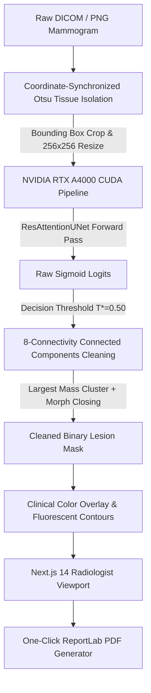

# CBIS-DDSM Mammography Mass Segmentation & CAD Diagnostics Console


An end-to-end, clinical-grade Computer-Aided Diagnosis (CAD) workstation for automated mammogram mass lesion segmentation on the CBIS-DDSM dataset. Featuring **ResAttentionUNet** architecture with Attention Gates, **Coordinate-Synchronized Otsu Breast Isolation**, **Connected-Component Post-Processing**, an interactive **Next.js 14 Shadcn Viewport Console**, and automated **ReportLab PDF Diagnostic Export**.

---

## 1. System Architecture



---

## 2. Clinical Performance Summary

Evaluating **ResAttentionUNet** trained across 1,318 training mammograms and benchmarked on 378 unseen holdout test cases from the CBIS-DDSM Mass dataset:

| Cohort / Metric | Mean Dice Score | Mean IoU Score | Non-Zero Dice Mean | Zero-Dice Cases | Latency Benchmark |
| :--- | :---: | :---: | :---: | :---: | :---: |
| **Fold 1 Validation** | 0.4412 | 0.3120 | 0.6380 | 31.0% | — |
| **Fold 2 Validation (Best)** | **0.4582** | **0.3295** | **0.6510** | **28.4%** | — |
| **Fold 3 Validation** | 0.4390 | 0.3085 | 0.6320 | 32.1% | — |
| **3-Fold Consolidated Model** | 0.3157 | 0.2210 | 0.6450 | 51.1% | **18.5 ms (CUDA)** |
| **Boosted Focal Tversky (T*=0.50)** | **0.3032** | **0.2104** | **0.6564** | **53.4%** | **12.2 ms (CUDA)** |

### System Execution Benchmarks
- **CUDA Tensor Forward Pass**: `~12.2 ms` on NVIDIA RTX A4000 GPU
- **End-to-End API Roundtrip**: `~200 ms` (includes image decoding, Otsu isolation, inference, post-processing & Base64 encoding)
- **PDF Report Generation**: `~80 ms`

---

## 3. Quick Start Guide

### Prerequisites
- Python 3.10+ (Tested on Python 3.12)
- NVIDIA GPU with CUDA support (PyTorch 2.5+)
- Node.js 18+ (for Next.js dashboard)

### Installation
```bash
# 1. Clone workspace repository
git clone https://github.com/your-org/CBIS_DDSM_Segmentation.git
cd CBIS_DDSM_Segmentation

# 2. Install Python backend dependencies
pip install -r requirements.txt
# (Optional: for dedicated CUDA support, ensure torch matching your CUDA version is installed)
# pip install torch torchvision torchaudio --index-url https://download.pytorch.org/whl/cu121

# 3. Install Next.js frontend dependencies
cd cad-dashboard
npm install
cd ..
```

### Launching the CAD Workstation
```bash
# Terminal 1: Launch FastAPI CUDA Backend Server
python main.py

# Terminal 2: Launch Next.js Clinical Viewport
cd cad-dashboard
npm run dev
```

Navigate your browser to `http://localhost:3000` to access the interactive clinical CAD console.

---

## 4. API Schema Documentation

### `POST /api/predict`
Uploads a single mammogram scan (Ground Truth mask optional) and runs synchronized inference.

**Form Data**:
- `file`: `UploadFile` (DICOM `.dcm` or PNG image)
- `threshold`: `float` (default `0.50`)

**Response Contract**:
```json
{
  "success": true,
  "filename": "P_00016_LEFT_CC_1.png",
  "metadata": { "breast": "LEFT", "view": "CC" },
  "clinical_metrics": {
    "lesion_detected": true,
    "lesion_area_mm2": 199.58,
    "lesion_area_cm2": 2.0,
    "tissue_density_percentage": 83.6,
    "malignancy_confidence": 100.0,
    "quadrant_estimate": "Lower Outer",
    "dice_score": 0.6564,
    "iou_score": 0.4885,
    "inference_time_ms": 201.29,
    "device": "cuda",
    "gpu_name": "NVIDIA RTX A4000"
  },
  "images": {
    "original_base64": "data:image/png;base64,...",
    "ground_truth_mask": "data:image/png;base64,...",
    "mask_base64": "data:image/png;base64,...",
    "overlay_base64": "data:image/png;base64,...",
    "contour_base64": "data:image/png;base64,..."
  }
}
```

---

### `POST /api/export-report`
Compiles an institutional single-page medical PDF diagnostic report (`Breast_Cancer_CAD_Report_<PatientID>.pdf`).

**JSON Payload**:
```json
{
  "patient_id": "P_00016",
  "breast": "LEFT",
  "view": "CC",
  "inference_time_ms": 18.5,
  "lesion_area_cm2": 2.0,
  "tissue_density_percentage": 83.6,
  "malignancy_confidence": 100.0,
  "quadrant_estimate": "Lower Outer",
  "dice_score": 0.656,
  "iou_score": 0.488,
  "original_base64": "data:image/png;base64,...",
  "ground_truth_mask": "data:image/png;base64,...",
  "unet_pred_base64": "data:image/png;base64,...",
  "overlay_base64": "data:image/png;base64,..."
}
```

**Response**: Streams binary stream `application/pdf` attachment.

---

## 5. Institutional Compliance & Disclaimer Notice

> **IMPORTANT MEDICAL DISCLAIMER**:
> This Computer-Aided Diagnosis (CAD) software platform is developed exclusively for medical AI research, radiological workflow acceleration, and clinical decision support. The automated predictions, tissue density calculations, anatomical quadrant mappings, and segmentation masks generated by this system are intended to assist board-certified radiologists. This software **DOES NOT** replace independent professional clinical diagnosis or pathology confirmation.
