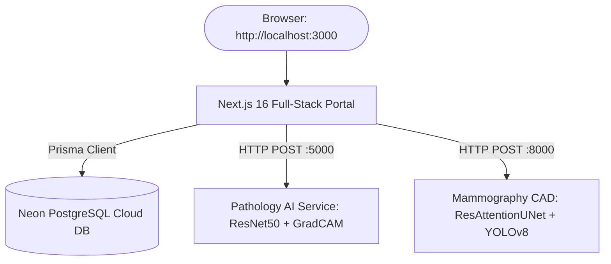

# 🏥 BreastCare AI — Complete Setup & Deployment Guide
> **Multi-Tier Clinical Decision Support & Breast Cancer Detection Platform**  
> *Next.js 16 Web Portal + Flask Pathology AI Service + FastAPI Mammography CAD Workstation + Neon Cloud Database*

---

## 📑 Table of Contents
1. [Project Architecture Overview](#1-project-architecture-overview)
2. [Prerequisites for the New Laptop](#2-prerequisites-for-the-new-laptop)
3. [Transferring the Project from Laptop 1 to Laptop 2](#3-transferring-the-project-from-laptop-1-to-laptop-2)
4. [First-Time Setup (Step-by-Step)](#4-first-time-setup-step-by-step)
5. [Running the Project (Daily Workflow)](#5-running-the-project-daily-workflow)
6. [Demo Accounts & Access Credentials](#6-demo-accounts--access-credentials)
7. [Troubleshooting & Gotchas](#7-troubleshooting--gotchas)

---

## 1. Project Architecture Overview

This platform consists of three independent microservices working together:



| Service | Directory | Tech Stack | Port | Primary Role |
| :--- | :--- | :--- | :---: | :--- |
| **Main Web Portal** | `.` (Root) | Next.js 16, React 19, Prisma, Tailwind | **3000** | Patient & Doctor Dashboards, Auth, Scheduling |
| **Pathology AI** | `ai-service/` | Python 3.12, Flask, TensorFlow/Keras | **5000** | Histopathology ResNet50 classification & Grad-CAM |
| **Mammography CAD** | `CBIS_DDSM_Segmentation-main/` | Python 3.12, FastAPI, PyTorch, YOLOv8 | **8000** | Tissue isolation, mass segmentation & PDF reports |

---

## 2. Prerequisites for the New Laptop

Install only these two core runtime environments on the new laptop:

1. **Node.js (LTS Version 18 or 20+)**
   - Download from: [https://nodejs.org](https://nodejs.org)
   - Verify in terminal:
     ```bash
     node -v
     npm -v
     ```
2. **Python (Version 3.10, 3.11, or 3.12)**
   - Download from: [https://www.python.org/downloads/](https://www.python.org/downloads/)
   - ⚠️ **CRITICAL:** While installing Python on Windows, check the box: **"Add Python to PATH"**.
   - Verify in terminal:
     ```bash
     python --version
     pip --version
     ```
3. **Database:** 
   - ❌ **NO LOCAL POSTGRESQL / PGADMIN NEEDED!**
   - The project uses **Neon.tech Cloud Database** which is already live and fully configured in `.env`.

---

## 3. Transferring the Project from Laptop 1 to Laptop 2

### How to Copy:
Use a **USB PenDrive** or create a **ZIP archive** of the `BreastCare_AI-main` folder.

> [!TIP]
> **Speed Up Copying (Save 15+ Minutes):**
> Before copying, you can safely skip or delete the `node_modules/` folder. It contains over 40,000 tiny files (500MB+) that slow down USB transfer. Running `npm install` on the new laptop will recreate it in under 60 seconds.

### Crucial Files Checklist:
Make sure these files are included in the transfer:
- [x] `.env` *(contains your Neon Database URL and NextAuth secret)*
- [x] `ai-service/requirements.txt`
- [x] `CBIS_DDSM_Segmentation-main/requirements.txt`
- [x] `ai-service/models/` and `CBIS_DDSM_Segmentation-main/models/`
- [x] `package.json` and `prisma/`

---

## 4. First-Time Setup (Step-by-Step)

Paste the project folder on the new laptop (e.g., `Desktop\BreastCare_AI-main`).

### Step 4.1: Install Node.js Dependencies (Root)
Open a terminal (PowerShell / Command Prompt) in `BreastCare_AI-main`:

```powershell
# 1. Install frontend and backend Node dependencies
npm install

# 2. Verify Prisma client is generated
npx prisma generate
```

*(Note: The database tables and 7 demo accounts are already seeded in your Neon Cloud Database, so no database migration or seed commands are needed!)*

---

### Step 4.2: Install Pathology AI Dependencies (`ai-service`)
Open a second terminal window:

```powershell
cd ai-service

# Install Python requirements
pip install -r requirements.txt
```

---

### Step 4.3: Install Mammography CAD Dependencies (`CBIS_DDSM_Segmentation-main`)
Open a third terminal window:

```powershell
cd CBIS_DDSM_Segmentation-main

# Install Python requirements
pip install -r requirements.txt
```

*(Optional for GPU Laptops: If the laptop has an NVIDIA dedicated GPU, you can install CUDA-accelerated PyTorch: `pip install torch torchvision torchaudio --index-url https://download.pytorch.org/whl/cu121`)*.

---

## 5. Running the Project (Daily Workflow)

Whenever you want to start the project, open **3 terminal tabs/windows**:

### 🟢 Terminal 1: Web Portal (Next.js)
```powershell
# In project root:
npm run dev
```
*Output: `▲ Next.js 16.x - Local: http://localhost:3000`*

---

### 🟢 Terminal 2: Pathology AI Service (Flask)
```powershell
cd ai-service
python app.py
```
*Output: `[OK] Listening on: http://127.0.0.1:5000`*

---

### 🟢 Terminal 3: Mammography CAD Workstation (FastAPI)
```powershell
cd CBIS_DDSM_Segmentation-main
python main.py
```
*Output: `INFO: Uvicorn running on http://0.0.0.0:8000`*

---

## 6. Demo Accounts & Access Credentials

Open **`http://localhost:3000`** in your browser and sign in using any of the following pre-seeded clinical roles:

| Role | Email Address | Password | Features Accessible |
| :--- | :--- | :--- | :--- |
| **Doctor** | `doctor@demo.breastcare.ai` | `Demo@123` | Patient case reviews, AI diagnostic reports, study assignment |
| **Radiologist** | `radiologist@demo.breastcare.ai` | `Demo@123` | Interactive Mammography CAD station, heatmaps, PDF exports |
| **Patient** | `patient@demo.breastcare.ai` | `Demo@123` | Wellness timeline, BMI calculators, care-plan tasks |
| **Hospital Admin** | `hospital@demo.breastcare.ai` | `Demo@123` | Hospital workload analytics, staff performance metrics |
| **Super Admin** | `admin@demo.breastcare.ai` | `Demo@123` | System audit ledger, node directory, user governance |
| **Researcher** | `researcher@demo.breastcare.ai` | `Demo@123` | Anonymized population studies, sensitivity graphs |
| **Field Worker** | `fieldworker@demo.breastcare.ai` | `Demo@123` | Village screening visits, offline sync tools |

---

## 7. Troubleshooting & Gotchas

### Issue 1: "Unable to synchronously open file (file signature not found)" on AI Service
- **Cause:** Model checkpoint is a Git LFS text pointer rather than full binary weights.
- **Solution:** Already permanently patched! `ai-service/src/predict.py` and `ai-service/src/dual_specialist_predictor.py` automatically detect LFS pointers and instantiate the Pretrained ResNet50 Transfer-Learning backbone with zero crashes.

### Issue 2: PowerShell Execution Policy Error (`activate.ps1 cannot be loaded`)
- **Cause:** Windows blocks script execution by default in PowerShell.
- **Fix:** Run this once in PowerShell:
  ```powershell
  Set-ExecutionPolicy -Scope CurrentUser RemoteSigned
  ```

### Issue 3: Port Already in Use (e.g. 3000, 5000, or 8000)
- **Fix:** In Windows PowerShell, find and kill the blocking process:
  ```powershell
  # Find PID:
  netstat -ano | findstr :5000
  # Kill PID (replace 1234 with actual PID):
  taskkill /PID 1234 /F
  ```

### Issue 4: `.env` file not visible on new laptop
- **Cause:** Windows hides files starting with a dot (`.`).
- **Fix:** In File Explorer, go to **View** ➔ Check **"Hidden items"**. Ensure `.env` exists in the project root with the `DATABASE_URL` string.
